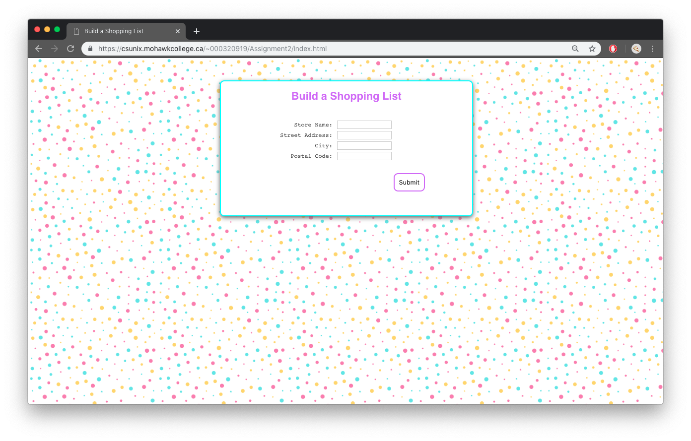
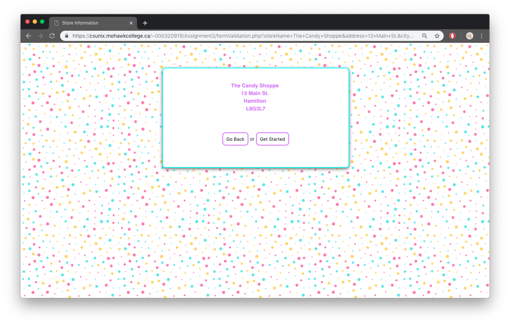
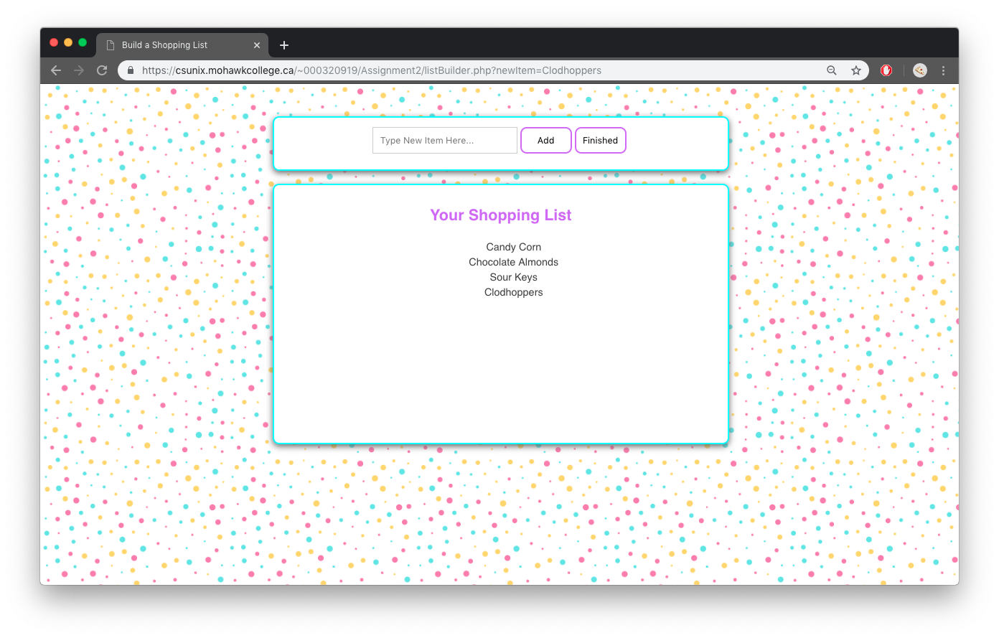
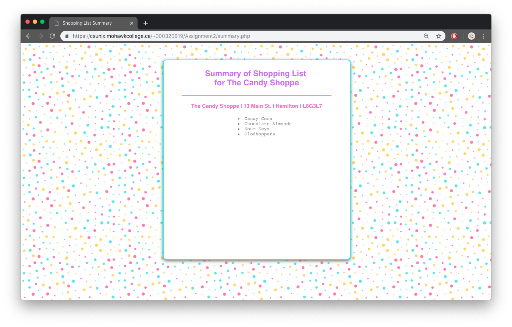

# ShoppingList
Builds a shopping list using store info!
*******************************************
The user inputs a store name and its address, regex validates all the parameters.
Then the user cana dd items and they appear on the screen. 
If a user enters the same item more than once, an error message is displayed.
When the user is finished, they click the finished button and a summary of the store info and list appears.
*******************************************

